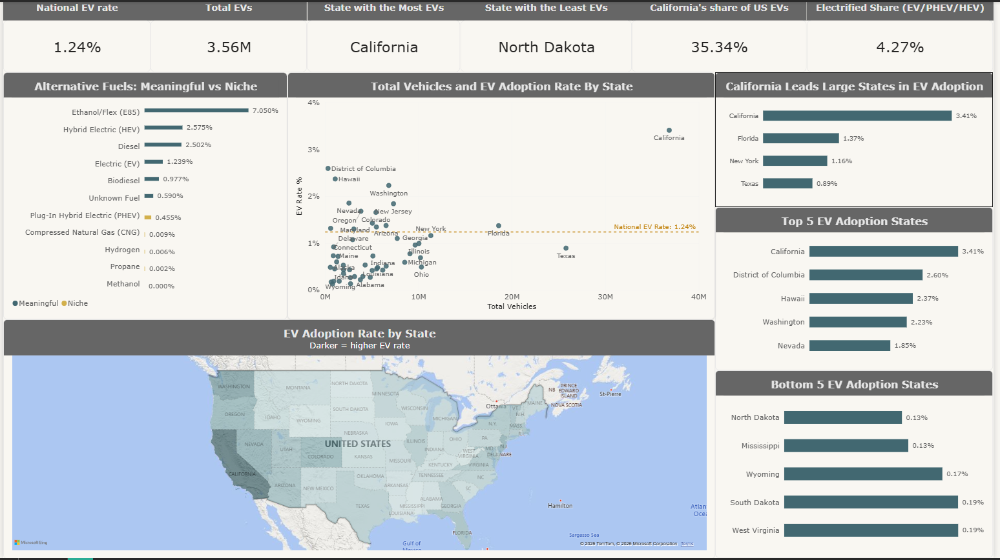
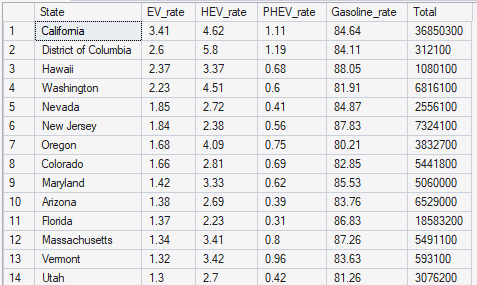
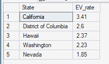
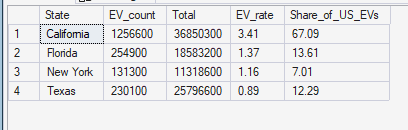

# US Vehicle Fuel Type & EV Adoption Analysis

Where are Americans actually buying electric vehicles, where aren't they, and what should that tell anyone deciding where to put a charger?

I analysed vehicle registrations by fuel type across all 50 states and the District of Columbia — roughly 287 million vehicles — to answer that. The short version: EV adoption is far more concentrated than the headlines suggest, and the states with the most EVs are not the states with the biggest opportunity.

**Tools:** SQL Server (import, cleaning, market-share queries) · Power BI (Power Query, DAX, dashboard)

---

## The dashboard

Six KPI cards across the top, a fuel-type ranking split into meaningful and niche, a scatter of fleet size against EV rate, a choropleth of adoption by state, and top-five / bottom-five league tables. The scatter is the one I'd point a stakeholder at first: it separates *how many* EVs a state has from *how concentrated* they are, and those two things tell very different stories.

---

## The questions I set out to answer

1. What share of each state's fleet is EV, PHEV, HEV and gasoline?
2. Which five states have the highest EV adoption rate?
3. How does California compare with the other large states — Texas, Florida, New York?
4. Which alternative fuels have real scale, and which are rounding errors?
5. Which states lead and lag, and what does that imply for infrastructure planning?

---

## What the data shows

### Gasoline still wins, comfortably

**84.6%** of registered vehicles run on gasoline. The national EV rate is **1.24%** — about 3.56 million cars. Add plug-in hybrids and plug-in vehicles reach **1.69%**; add standard hybrids and the electrified share is **4.27%**.

Put plainly: after a decade of EV coverage, roughly 24 in every 25 vehicles on American roads still burn petrol.

### Fuel mix by state

Ranking every state by EV rate puts California first at 3.41% and, further down the table, North Dakota and Mississippi last at 0.13%. That is a **26-fold gap** between the top and bottom of the same country.

### Adoption is concentrated, not widespread

California alone accounts for **35.3% of every EV in the country** (1.26 million) while holding only about 13% of registered vehicles. Its 3.41% adoption rate is **2.75x the national average**, and only **14 of 51** jurisdictions sit above that average at all.

| Top 5 by EV rate | | Bottom 5 by EV rate | |
|---|---|---|---|
| California | 3.41% | North Dakota | 0.13% |
| District of Columbia* | 2.60% | Mississippi | 0.13% |
| Hawaii | 2.37% | Wyoming | 0.17% |
| Washington | 2.23% | South Dakota | 0.19% |
| Nevada | 1.85% | West Virginia | 0.19% |

*DC is not a state. Exclude it and New Jersey (1.84%) takes fifth place.

### California against the other big fleets

| State | EVs | Total fleet | EV rate |
|---|---|---|---|
| California | 1,256,600 | 36,850,300 | 3.41% |
| Florida | 254,900 | 18,583,200 | 1.37% |
| New York | 131,300 | 11,318,600 | 1.16% |
| Texas | 230,100 | 25,796,600 | 0.89% |

California's rate is about **2.5x Florida's and nearly 4x Texas's**. Texas is the interesting case: it has almost as many EVs as Florida in absolute terms, but the lowest rate of the four, because its 25.8 million-vehicle fleet is so large that the EVs disappear into it.

This is why I reported both count and rate throughout. Ranked by count, Texas looks like an EV state. Ranked by rate, it is near the bottom of the large states. Only reporting one of those would mislead whoever is reading.

> **A note on the query output:** the `Share_of_US_EVs` column in the screenshot above is calculated with a window function that runs *after* the `WHERE` clause, so 67.09% is California's share of these four states — not of the US. California's genuine national share is the 35.3% quoted earlier. The column name is due a rename.

### Alternative fuels: real versus rounding error

**Real scale.** Ethanol/Flex (E85) is the largest alternative fuel at **7.05%** (20.2 million vehicles), ahead of hybrids (2.58%), diesel (2.50%), EVs (1.24%) and biodiesel (0.98%).

**Rounding errors.** PHEVs sit at 0.46%, just under the 0.5% line I used as a cutoff. CNG, hydrogen and propane are each below 0.01%, and there is not a single registered methanol vehicle in the dataset.

The hydrogen number is the one worth pausing on: **all 16,900 hydrogen vehicles in the US are in California**, the only state with a public refuelling network. It is the cleanest example in the whole dataset of adoption following infrastructure rather than the other way round.

---

## Why the gap might exist

These are **hypotheses**. They fit the patterns in the data, but this dataset cannot test them — it contains registrations and nothing else.

**Distance and density.** State size alone doesn't explain it: California is both the biggest fleet and the leader. The stronger pattern is urban versus rural. Dense places (DC, states built around large metros) lead; sparsely populated ones (North Dakota, Wyoming, South Dakota) trail. Longer drives, thinner charger coverage and range anxiety all push the same way.

**Charging infrastructure.** Chargers and EVs almost certainly reinforce each other — more chargers make EVs viable, more EVs justify more chargers. Hydrogen in California is that loop in miniature.

**Political lean.** Adoption tracks it closely. The top four (California, DC, Hawaii, Washington) lean strongly Democratic; all five of the bottom states lean strongly Republican, and national surveys have consistently found Democrats likelier to consider an EV. But political lean is tangled up with urbanisation, income, state incentives and charger density, so **this analysis cannot isolate politics as a cause** — and there are real exceptions. Florida leans Republican and sits above the national average; Nevada is a swing state in the top five.

---

## What I'd do with this if I were planning infrastructure

**Lagging rural states** are stuck in a chicken-and-egg problem. The unlock is **highway-corridor fast charging** to kill range anxiety on long trips — not dense urban networks they don't yet need.

**Leading states** have the opposite problem: **grid capacity**. Home and workplace charging at scale means local distribution upgrades, not more public chargers.

**High-volume, low-rate states are the real prize.** Texas and Florida between them hold over 44 million vehicles. Moving Texas from 0.89% to Florida's 1.37% would add roughly 124,000 EVs — more than New York's entire EV fleet.

**Hybrids are a leading indicator.** At 2.58%, HEVs outnumber EVs two to one. That looks like appetite for electrification held back by charging access rather than by the technology itself.

---

## Limitations

- A single point-in-time snapshot, so I can't show trends or growth rates.
- No charger, income, density or political data in the source, which is why the explanations above stay labelled as hypotheses.
- Fuel categories come from the source data as-is. "Unknown Fuel" (0.59%) is left in the totals rather than redistributed.

## Where I'd take it next

- Join charging-station counts from the **US DOE Alternative Fuels Data Center** to get chargers per EV by state — the single most useful missing column.
- Add population density, median income and election results, then test the hypotheses above properly with correlation or regression rather than inference.
- Pull earlier registration years to turn a snapshot into a growth curve.

---

## Repository contents

| File | Description |
|---|---|
| `Market_share_analysis.sql` | SQL Server queries: fuel-type market share, top-5 adoption, large-state comparison |
| `EV Viz.pbix` | Power BI report, including Power Query steps and DAX measures |
| `Dashboard.png` | Dashboard screenshot |
| `fuel-mix-by-state.png` | Query result: fuel-type share by state |
| `top-5-ev-adoption.png` | Query result: top five states by EV rate |
| `ca-vs-large-states.png` | Query result: California vs Texas, Florida and New York |

The source registration data is not committed to the repository.

---

### About me

Data Analyst based in **Manchester, UK**, working in **SQL, Power BI, Tableau and Excel**.
[LinkedIn](https://www.linkedin.com/in/ibomeno-basiekanem/) · [Portfolio](https://thelordbass.github.io/)
